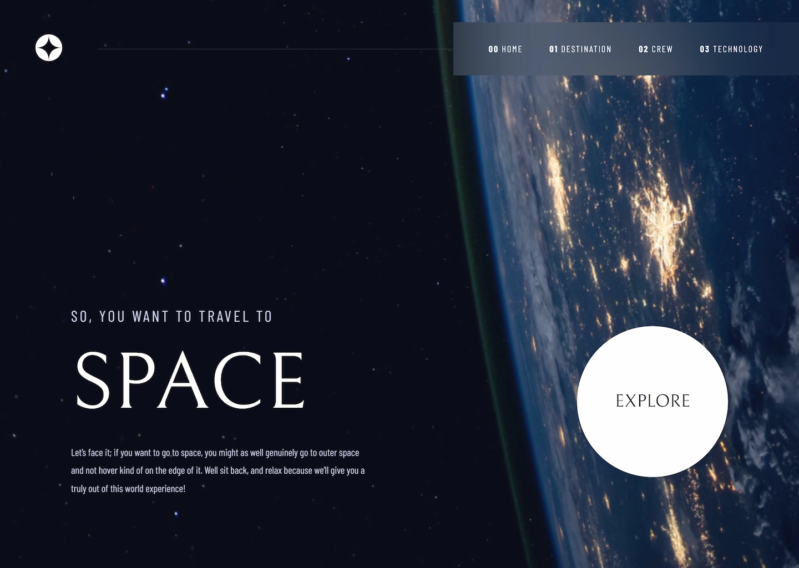
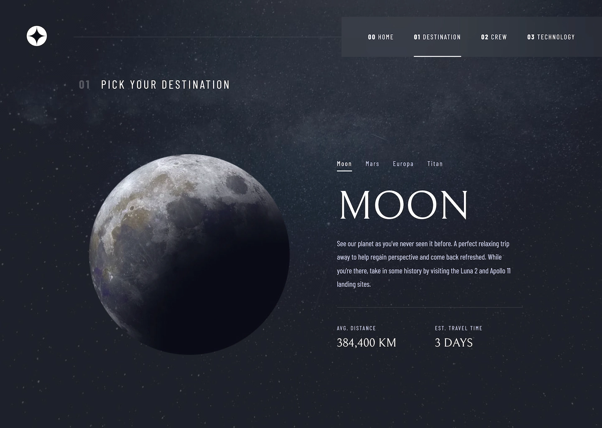
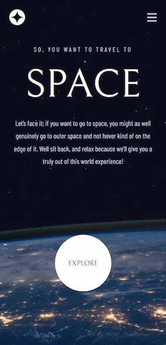
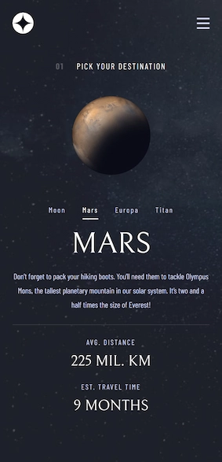

# Frontend Mentor - Space tourism website solution

This is a solution to the [Space tourism website challenge on Frontend Mentor](https://www.frontendmentor.io/challenges/space-tourism-multipage-website-gRWj1URZ3). Frontend Mentor challenges help you improve your coding skills by building realistic projects.

### The challenge

Users should be able to:

- View the optimal layout for each of the website's pages depending on their device's screen size
- See hover states for all interactive elements on the page
- View each page and be able to toggle between the tabs to see new information

### Screenshots

### Links

- [Live Site URL](https://crissvp.github.io/space-tourism-website/)

### Built with

- Flexbox
- CSS Grid
- Semantic HTML5 markup
- CSS custom properties
- Mobile-first workflow
- Astro framework

## Author

- Frontend Mentor - [@CrissVp](https://www.frontendmentor.io/profile/CrissVp)

